<div align="center">


# OpenWrt Manager

**OpenWrt 路由器管理工具**

一款用于管理OpenWRT的工具，支持Windows、Linux和Android

[](https://www.gnu.org/licenses/gpl-3.0)
[](https://github.com/StephenJose-Dai/OpenWRT-Manager/releases/latest)
[](https://github.com/StephenJose-Dai/OpenWRT-Manager/stargazers)
[](https://github.com/StephenJose-Dai/OpenWRT-Manager/network/members)

[📥 下载最新版本](#下载) · [🐛 报告问题](https://github.com/StephenJose-Dai/OpenWRT-Manager/issues) · [💬 讨论](#进群交流)

</div>

---

## 功能特性

- 🖥 **Windows 桌面端** — 支持 Windows 7 / 8 / 10 / 11，x64 / x86
- 📱 **Android 移动端** — 支持手机和平板，自适应侧边栏布局
- 🔒 **HTTP / HTTPS** — 支持自签名证书，忽略 SSL 证书验证
- 📊 **控制台** — 系统信息、内存使用、WAN 接口状态
- 📱 **设备管理** — DHCP 租约列表、ARP 表、踢出设备
- 📈 **流量统计** — 实时速率图表（读取 `/proc/net/dev`）
- 🛡 **防火墙** — 规则 / 区域 / 端口转发，新增 / 删除规则
- ⚙️ **系统管理** — WiFi 密码修改、系统日志、软件升级检查
- 🔍 **局域网扫描** — 自动发现路由器，支持 HTTP / HTTPS / 8080 端口

---

## 截图
<div align="center">
    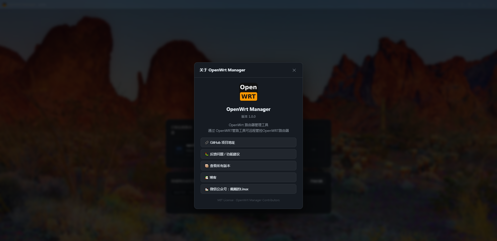
    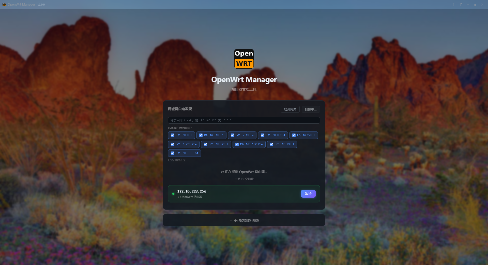
    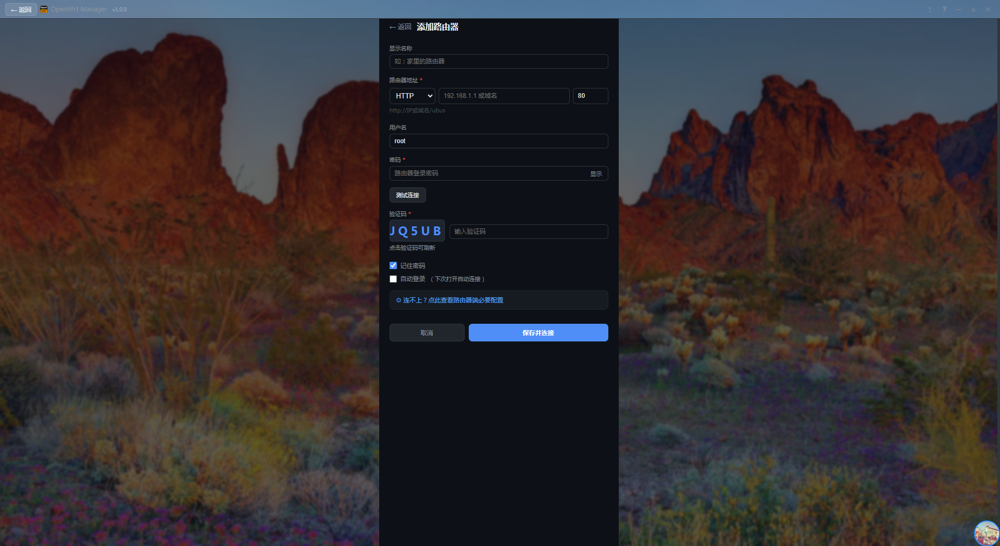
    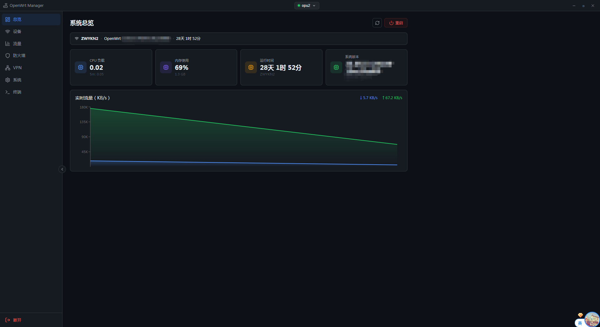
    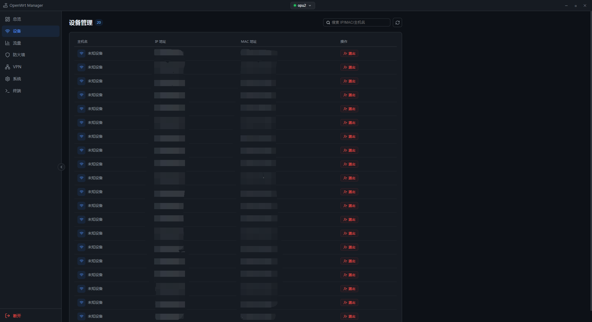
    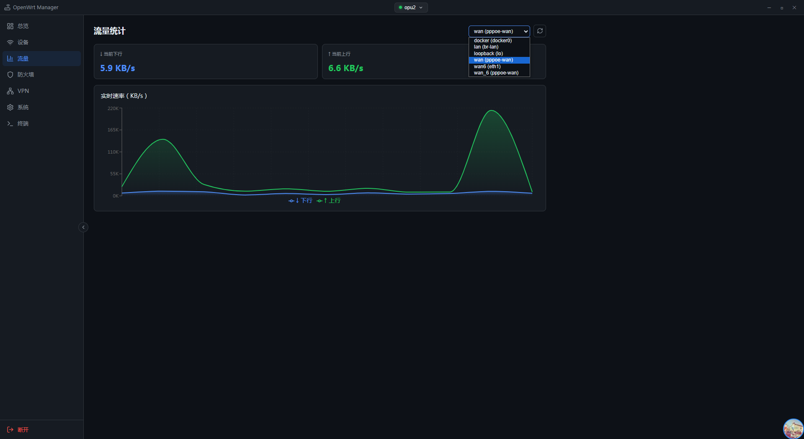
    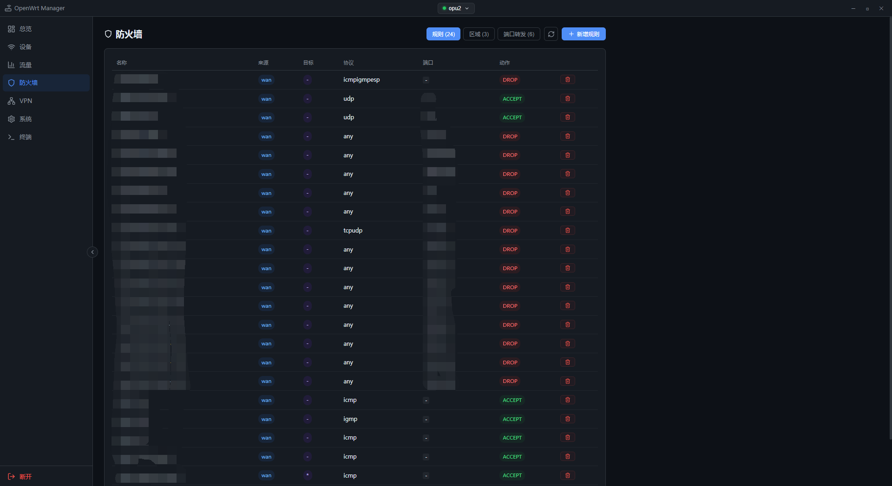
    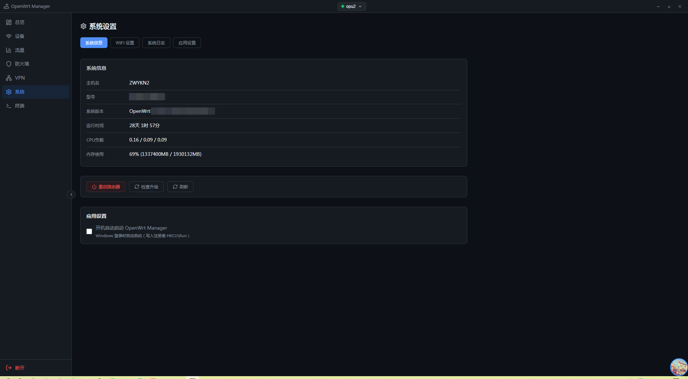
    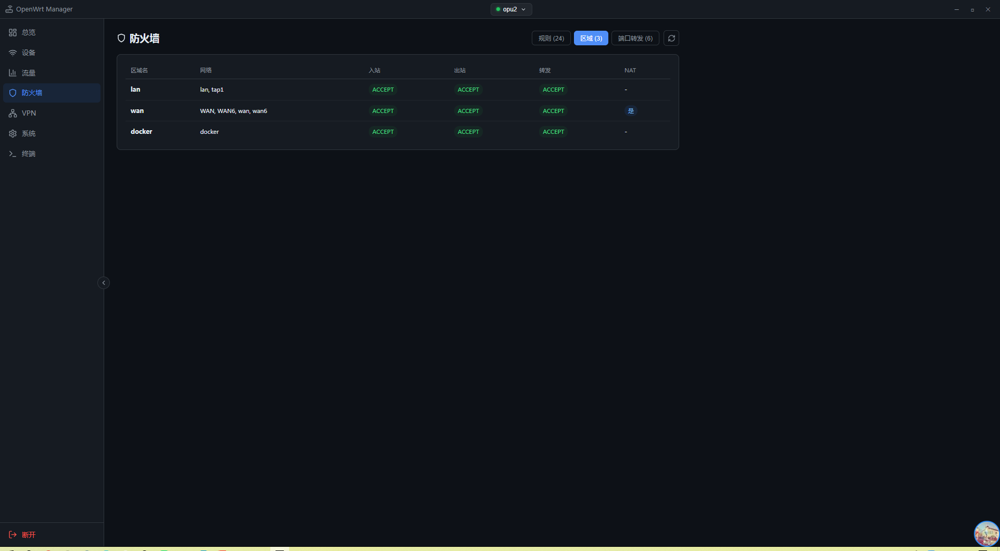
    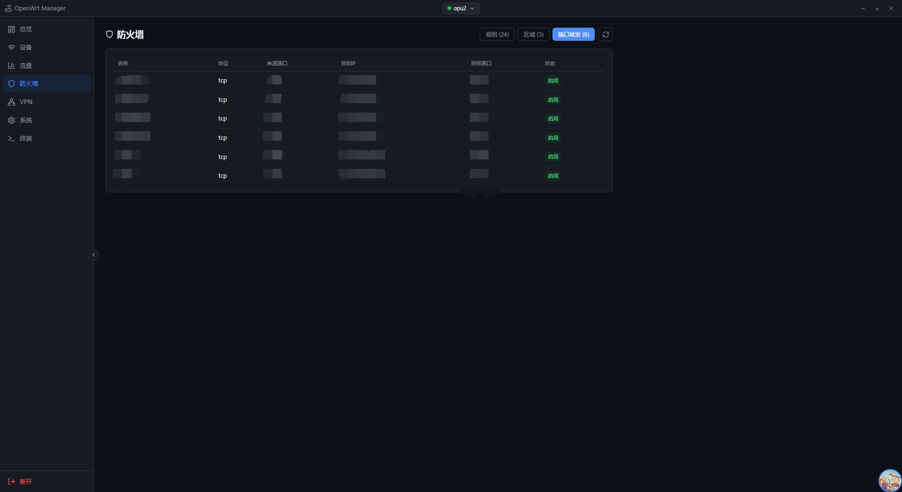
    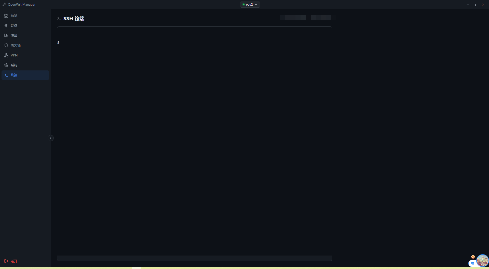
    
    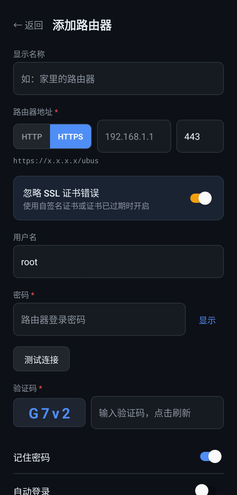
    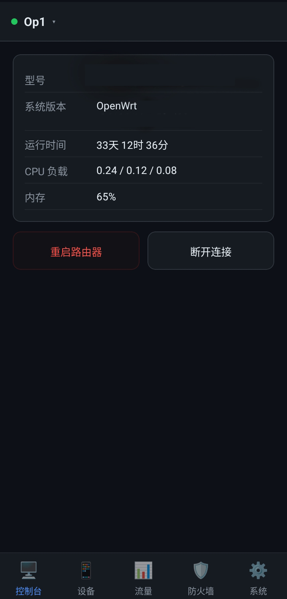
    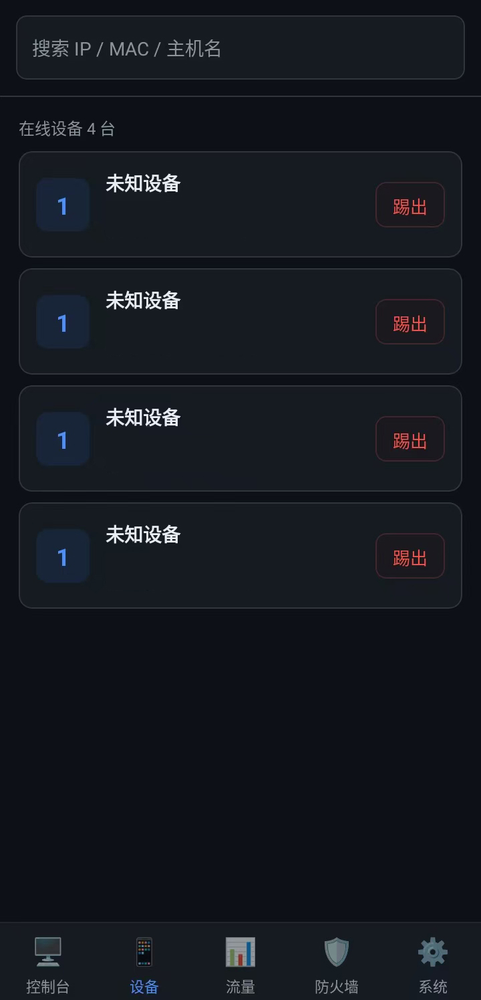
    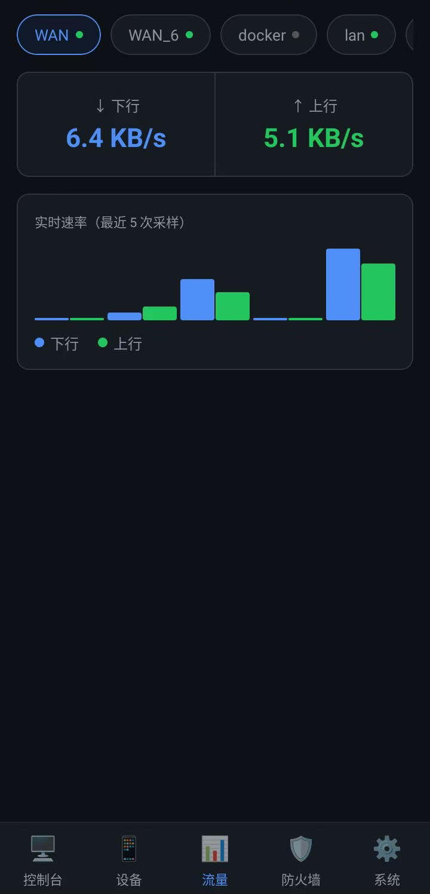
    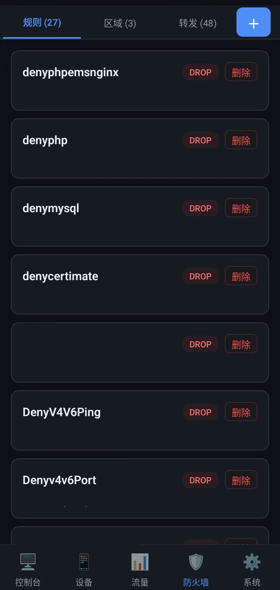
    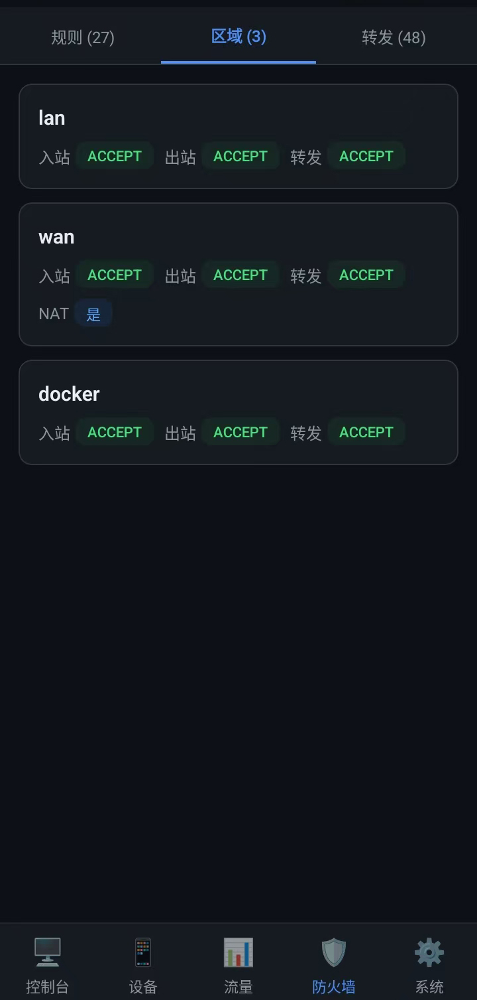
    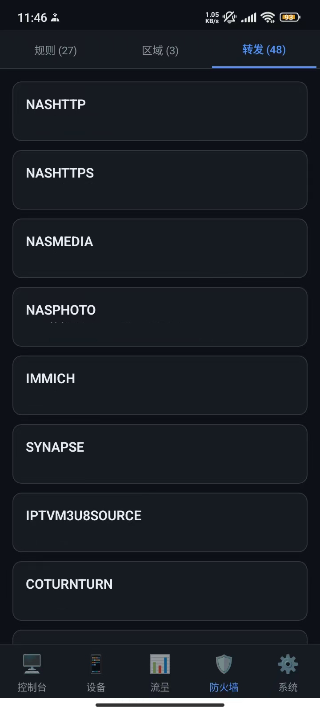
    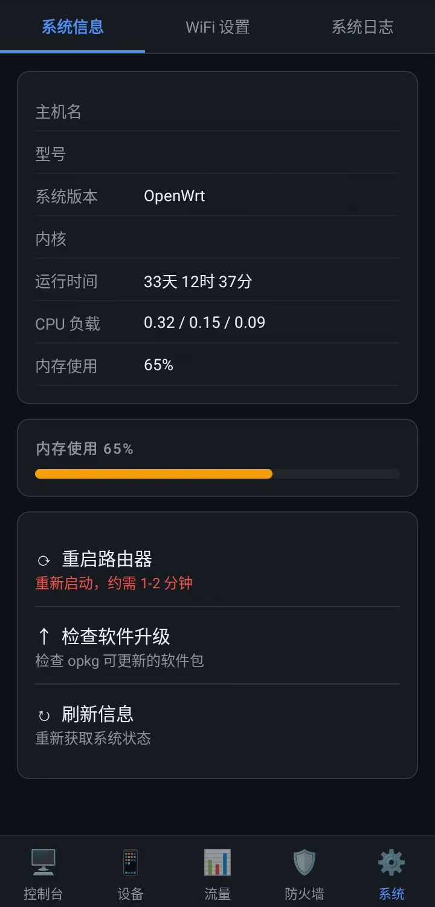
</div>

---

## 下载

前往 [Releases 页面](https://github.com/StephenJose-Dai/OpenWRT-Manager/releases/latest) 下载最新版本。

| 平台 | 文件 | 说明 |
|------|------|------|
| Windows 10/11 x64 | `OpenWrtManager-*-win10-x64-setup.exe` | 安装版，推荐 |
| Windows 10/11 x64 | `OpenWrtManager-*-win10-x64-portable.exe` | 免安装版 |
| Windows 10/11 x86 | `OpenWrtManager-*-win10-ia32-setup.exe` | 32位 |
| Windows 7/8/8.1 x64 | `OpenWrtManager-*-win7-x64-setup.exe` | 旧系统兼容版 |
| Android ARM64 | `OpenWrtManager-*-android-arm64-release.apk` | 主流安卓手机，推荐 |
| Android ARMv7 | `OpenWrtManager-*-android-armv7-release.apk` | 老款安卓手机 |
| Android x86_64 | `OpenWrtManager-*-android-x86_64-release.apk` | 平板 / 模拟器 |
| Linux x64 | `OpenWrtManager-*-linux-x64.AppImage` | 通用 Linux |
| Linux x64 | `OpenWrtManager-*-linux-x64.deb` | Debian / Ubuntu |

> Android APK 安装前需在手机设置中开启「允许未知来源安装」。

---

## 路由器端初始化（一次性）

首次连接前，需在路由器上安装必要组件并配置权限：

```bash
# 1. 安装依赖包
opkg update && opkg install rpcd-mod-file luci-mod-rpc

# 2. 创建 ACL 权限文件
cat > /usr/share/rpcd/acl.d/owm.json << 'ACLEOF'
{
  "root": {
    "read": {
      "ubus": {"*": ["*"]},
      "uci":  {"*": ["read"]},
      "file": {"*": ["read","exec","list"]}
    },
    "write": {
      "ubus": {"*": ["*"]},
      "uci":  {"*": ["read","write"]},
      "file": {"*": ["read","write","exec","list"]}
    }
  }
}
ACLEOF

# 3. 重启 rpcd 生效
/etc/init.d/rpcd restart
```

> 应用连接路由器后会**自动写入上述配置**，通常无需手动操作。

---

## 手动编译

### 环境要求

| 工具 | 版本要求 |
|------|---------|
| Node.js | >= 18 |
| npm | >= 9 |
| Java JDK | 17（仅 Android）|
| Android SDK | API 34，NDK 26.1（仅 Android）|

---

### Windows / Linux 桌面端

```bash
# 1. 进入桌面端目录
cd desktop

# 2. 安装依赖
npm install

# 3. 开发模式（热更新）
npm run dev

# 4. 构建前端资源
npm run build

# 5. 打包为可执行文件

# Windows 安装包 + 便携版（x64）
npx electron-builder --win nsis portable --x64

# Windows 安装包（x86）
npx electron-builder --win nsis --ia32

# Linux AppImage + deb
npx electron-builder --linux AppImage deb --x64

# 输出目录：desktop/dist-electron/
```

**Windows 7 / 8 兼容版**（使用 Electron 22）：

```bash
cd desktop
npm install electron@22.3.27 --save-dev --no-save
npx electron-builder --win nsis --x64
```

---

### Android 端

#### 前置准备

1. 安装 [Android Studio](https://developer.android.com/studio) 或单独安装 Android SDK
2. 配置环境变量：
   ```bash
   export ANDROID_HOME=$HOME/Android/Sdk        # Linux/macOS
   export ANDROID_HOME=%LOCALAPPDATA%\Android\sdk  # Windows
   ```
3. 安装 NDK：
   ```bash
   sdkmanager "ndk;26.1.10909125"
   ```

#### 生成签名密钥（release 版本需要）

```bash
keytool -genkeypair \
  -v \
  -storetype PKCS12 \
  -keystore my-release.keystore \
  -alias mykey \
  -keyalg RSA \
  -keysize 2048 \
  -validity 10000
```

#### 构建步骤

```bash
# 1. 进入移动端目录
cd mobile

# 2. 安装 JS 依赖
npm install --legacy-peer-deps

# 3. 打包 JS Bundle
mkdir -p android/app/src/main/assets
npx react-native bundle \
  --platform android \
  --dev false \
  --entry-file index.js \
  --bundle-output android/app/src/main/assets/index.android.bundle \
  --assets-dest android/app/src/main/res

# 4a. 构建 Debug APK（无需签名）
cd android
./gradlew assembleDebug

# 4b. 构建 Release APK（需要签名密钥）
./gradlew assembleRelease \
  -PkeystoreFile=/path/to/my-release.keystore \
  -PkeyAlias=mykey \
  -PkeyPassword=你的密钥密码 \
  -PstorePassword=你的keystore密码

# 输出目录：
# Debug:   android/app/build/outputs/apk/debug/
# Release: android/app/build/outputs/apk/release/
```

#### 按架构分包

默认会按 CPU 架构输出多个 APK：

| 文件名 | 适用设备 |
|--------|---------|
| `app-arm64-v8a-release.apk` | 主流手机（ARM64）✅ 推荐 |
| `app-armeabi-v7a-release.apk` | 老款手机（ARMv7）|
| `app-x86_64-release.apk` | 平板 / 模拟器 |
| `app-x86-release.apk` | x86 模拟器 |

---

## 项目结构

```
OpenWrt-Manager/
├── desktop/                    # Electron 桌面端（Windows / Linux）
│   ├── electron/
│   │   ├── main.js             # 主进程（ubus 代理、托盘）
│   │   └── preload.js          # 渲染进程桥接
│   ├── src/
│   │   ├── components/         # 通用组件（布局、连接管理）
│   │   └── pages/              # 功能页面
│   └── package.json
├── mobile/                     # React Native Android 端
│   ├── src/
│   │   ├── screens/            # 功能页面
│   │   ├── services/           # OpenWrt SDK
│   │   ├── hooks/              # 自定义 Hooks
│   │   └── components/         # 通用组件
│   ├── android/                # Android 原生项目
│   └── package.json
├── shared/
│   └── openwrt-client.js       # 桌面端共享 SDK
└── .github/workflows/          # GitHub Actions 自动构建
```

---

## 常见问题

**Q: 提示「权限不足」或无法获取数据？**

手动执行路由器初始化命令，或在应用设置中点击「重新配置 ACL」。

**Q: HTTPS 连接提示证书错误？**

在添加路由器时开启「忽略 SSL 证书错误」选项。路由器使用自签名证书时需要此选项。

**Q: Windows 提示「未知发布者」或 SmartScreen 警告？**

点击「更多信息」→「仍要运行」。未购买代码签名证书时会出现此提示，程序本身安全无害。

**Q: Android 安装提示「解析包时出现问题」？**

请下载与您设备 CPU 架构对应的 APK，主流手机选 `arm64` 版本。

---

## 开发技术栈

| 端 | 技术 |
|----|------|
| 桌面端 | Electron 28 + React 18 + Vite 5 |
| 移动端 | React Native 0.73 + Android |
| 通信协议 | ubus HTTP JSON-RPC |

---

## 许可证

本项目基于 [GNU General Public License v3.0](LICENSE) 开源。
基于本项目进行二开、传播等行为的，需保留原作者的所有信息以及出处，否则作者将保留追究侵权的法律责任的权利。

```
Copyright (C) 2024  YOUR_NAME

This program is free software: you can redistribute it and/or modify
it under the terms of the GNU General Public License as published by
the Free Software Foundation, either version 3 of the License, or
(at your option) any later version.
```

---

## 作者

**StephenJose_Dai**

- GitHub: [@StephenJose-Dai](https://github.com/StephenJose-Dai)
- 项目地址: [https://github.com/StephenJose-Dai/OpenWRT-Manager](https://github.com/StephenJose-Dai/OpenWRT-Manager)
- Blog: https://daishenghui.club

## 进群交流


---

<div align="center">

如果这个项目对你有帮助，欢迎点个 ⭐ Star！

[](https://star-history.com/#StephenJose-Dai/OpenWRT-Manager&Date)

</div>
